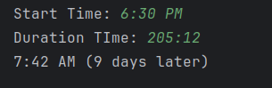

<h1>Time Calculator in Python</h1>
 
<h2>Features</h2>
<ul>
    <li> A start time in the 12-hour clock format (ending in AM or PM)</li>
    <li>A duration time that indicates the number of hours and minutes</li>
    <li>Returns exact time and days count</li>
</ul>

<h2>Acknowledgments</h2>

<b> Python3: http://bit.ly/python3-certifications <b>
 

<h2>Photo</h2>

 

<h2>Contact</h2>

<b> Email: mariusc0023@gmail.com </b>
